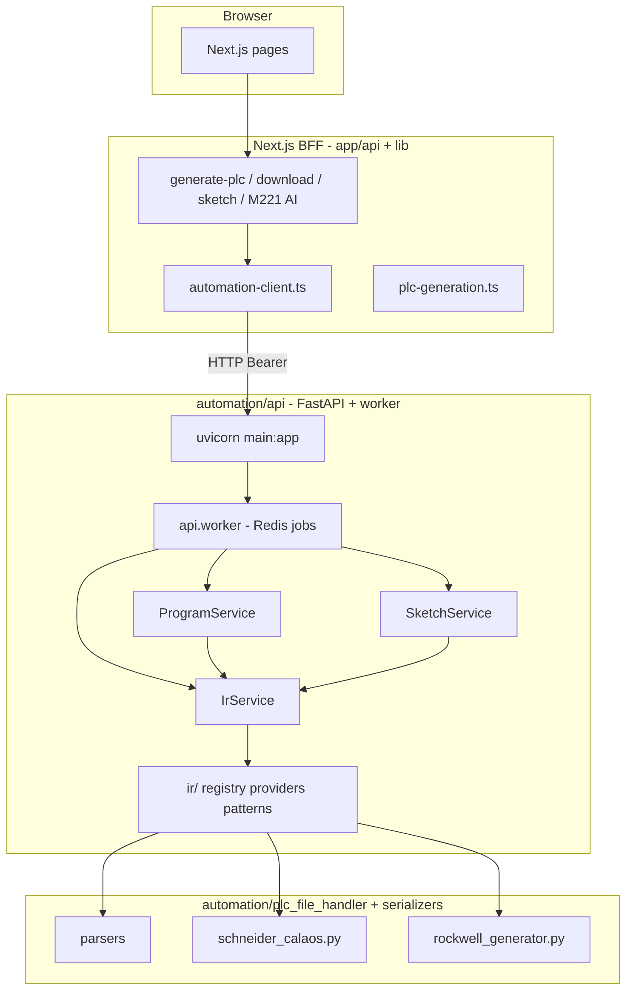
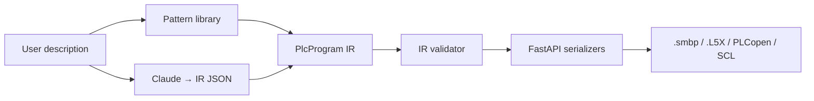

# FastAPI Automation Service — Design Document

> **Status:** IMPLEMENTED — Phases 0–5 + Platform Integrations §7.0 + **v1.6** HMI/usage (2026-06-16).  
> **Historical note:** §3–§8 below retain the original design narrative; §2 is the as-built reference.
> **Author:** PLCAutoPilot architecture  
> **Date:** 2026-06-14  
> **Supersedes:** [PHASE_4 § Decision D2](PHASE_4_PLATFORM_INTEGRATIONS.md) (TS-native serializers as primary runtime)

---

## 1. Executive summary

PLCAutoPilot runs Python automation through a **long-running FastAPI service** (`automation/api/`). Next.js `app/api/*` routes call `lib/automation-client.ts` over HTTP — **no** `child_process.spawn('python3', …)`.

The service is the **single source of truth** for parse, generate, convert, sketch analysis, Claude→IR, and vendor export via the **IR pipeline** (`automation/api/ir/`).

**Outcome (delivered):** Docker Compose sidecar + Redis job queue, structured errors, health checks, 403 pytest, golden export CI, provider registry, HMI generation (`ai.hmi.generate`).

**Next:** [V1_6_IMPLEMENTATION.md](V1_6_IMPLEMENTATION.md) — delivered; v1.7+ tracks in [PHASE_5_IMPLEMENTATION.md](PHASE_5_IMPLEMENTATION.md) §5.

---

## 2. Current state (as-built)

### 2.1 Architecture today



### 2.2 BFF routes (production)

| Route | Mechanism | Output |
|-------|-----------|--------|
| `app/api/analyze-sketch/route.ts` | `automationClient.analyzeSketch()` → `/v1/sketches/analyze` | Sketch analysis JSON |
| `app/api/generate-from-sketch/route.ts` | `generateFromSketch()` → `/v1/sketches/generate` | Binary default; `include_metadata=true` → JSON + `ir` |
| `app/api/generate-plc/route.ts` | `generateProgram()` → `/v1/programs/generate` | Pattern / IR generation |
| `app/api/download-program/route.ts` | FastAPI serialize / plcopen | Vendor bytes from IR |
| `app/api/generate-plc-ai/route.ts` | `/v1/programs/m221/generate` | Calaos `.smbp` + `metadata.ir` |
| `app/api/recommend-plc/route.ts` | `recommendPlc()` → `/v1/ai/recommend-plc` | Ranked PLCs + `source: ai\|fallback` |
| `app/api/recommend-solution/route.ts` | `recommendSolution()` → `/v1/ai/recommend-solution` | Recommended solution + alternatives + `source` |
| `app/api/rectify-error/route.ts` | `rectifyError()` → `/v1/ai/rectify-error` | Analysis, fixes, recommendations + `source` |
| `app/api/ai-chat/route.ts` | `copilotChat()` → `/v1/ai/copilot/chat` | Prompts in `api/services/ai_prompts.py` |
| `app/api/ai-engineer-chat/route.ts` | `engineerChat()` → `/v1/ai/engineer/chat` | Persona prompts in Python |
| `app/api/ai-generate-application/route.ts` | `generateApplication()` → `/v1/ai/application/generate` | JSON application blueprint |
| `app/api/ai-library-search/route.ts` | `librarySearch()` → `/v1/ai/library/search` | Library search JSON |
| `app/api/ai-optimize-code/route.ts` | `optimizeCode()` → `/v1/ai/code/optimize` | Optimization analysis JSON |
| `app/api/hmi-generate/route.ts` | `generateHmi()` → `/v1/ai/hmi/generate` | HMI script + tags CSV + zip (`?download=true` for attachment) |

Legacy generic `/v1/ai/chat` and `/v1/ai/json` remain for internal use; production BFF uses typed routes above.

### 2.3 Python packages

| Package | Path | Role |
|---------|------|------|
| **automation/api** | `automation/api/` | FastAPI HTTP, services, IR pipeline, job worker |
| **plc_file_handler** | `automation/plc_file_handler/` | Parsers, sketch vision, CLI (`cli.py` uses IR for `--from-sketch` and `--from-json`) |
| **plc_automation** | `automation/plc_automation/` | PLCopen / legacy desktop helpers; see `README.md` for deprecated scripts |
| **Legacy desktop** | `automation/*.py` (PyAutoGUI) | Windows-only; **out of scope** for HTTP service |

Dependencies (`automation/pyproject.toml`, lockfile `automation/uv.lock`):

```
fastapi, uvicorn, python-multipart, pydantic-settings, redis, anthropic, pillow, httpx
```

Install: `cd automation && uv sync`

### 2.4 Historical problems (resolved)

The pre-FastAPI design used `spawn('python3', cli.py …)` per request and duplicate TS vendor templates. Those paths are **removed** from production BFF routes. See §9 phase log for migration timeline.

Reference: [PHASE_4_PLATFORM_INTEGRATIONS.md](PHASE_4_PLATFORM_INTEGRATIONS.md) §2b.

---

## 3. Goals and non-goals

### 3.1 Goals

- Replace **all** `child_process.spawn('python3', …)` calls with HTTP to a long-running FastAPI service.
- Route **program generation and download** through Python generators (`schneider_generator.py`, `rockwell_generator.py`, `plcopen_xml.py`) until IR serializers exist.
- Standard **JSON error model**, request timeouts, health/readiness probes.
- **Docker Compose** profile: `next` + `postgres` + `automation-api`.
- Preserve Next.js for **auth, UI, and BFF orchestration** (calls automation API; no vendor file logic in TS).
- Document API for **humans and Cursor agents** (OpenAPI at `/docs`).

### 3.2 Non-goals (v1 of FastAPI service)

- Exposing PyAutoGUI / EcoStruxure desktop download over HTTP (Windows GUI automation stays CLI/desktop).
- **Billing / Stripe / subscription enforcement** — out of scope; Next.js may show UI placeholders only.
- Native binary export (`.acd`, `.zap`, `.gxw`) — still Tier 2 per Phase 4.

---

## 4. Proposed architecture

### 4.1 Target topology

```mermaid
flowchart TB
  subgraph browser [Browser]
    UI[Next.js pages]
  end

  subgraph next [Next.js - BFF layer]
    API[app/api/* routes]
    CLIENT[lib/automation-client.ts]
  end

  subgraph auto_svc [automation-api - FastAPI :8000]
    R1[/v1/sketches/*]
    R2[/v1/programs/*]
    R3[/v1/formats]
    R4[/health]
    SVC[service layer]
  end

  subgraph pkgs [automation/ packages - unchanged core]
    PFH[plc_file_handler]
    PLA[plc_automation]
  end

  DB[(Postgres)]

  UI --> API
  API --> CLIENT
  CLIENT -->|HTTP JSON/multipart| auto_svc
  R1 & R2 & R3 --> SVC
  SVC --> PFH & PLA
  API --> DB
```

### 4.2 Responsibility split

| Layer | Owns |
|-------|------|
| **Next.js `app/api`** | Auth session, user/org context, DB persistence, rate limits, calling automation service |
| **FastAPI `automation/api`** | PLC file I/O, sketch vision, format validation, binary/text artifact generation |
| **`automation/plc_*`** | Domain logic (no HTTP awareness) |
| **Postgres** | Users, projects, `generated_programs` (unchanged) |

### 4.3 Revision to Phase 4 Decision D2

Phase 4 chose **TS-native serializers** to avoid runtime Python in cloud deploys.

**New decision (pending approval): D2′ — Python FastAPI as runtime serializer host**

| Aspect | Old D2 | New D2′ |
|--------|--------|---------|
| Runtime serializers | TypeScript in Next.js | Python in FastAPI (existing generators) |
| Deploy unit | Single Node process | Node + Python containers (Compose/K8s) |
| CI validation | Python round-trip | Same — Python parses FastAPI output |
| TS generators | Port from Python | **Deprecate** after parity |

Rationale: Python generators already emit **valid** `.smbp` / `.L5X` / PLCopen; porting to TS duplicated effort and produced invalid files. A sidecar service is simpler than a full port for v1.5.

---

## 5. FastAPI service design

### 5.1 Repository layout (proposed)

```
automation/
├── api/                          # NEW — FastAPI application
│   ├── main.py                   # app factory, router mount, lifespan
│   ├── config.py                 # pydantic-settings (env)
│   ├── dependencies.py           # auth, temp dirs, service clients
│   ├── middleware.py             # request ID, logging, timeout
│   ├── routers/
│   │   ├── health.py
│   │   ├── formats.py
│   │   ├── sketches.py
│   │   └── programs.py
│   ├── schemas/                  # Pydantic request/response models
│   │   ├── common.py
│   │   ├── sketches.py
│   │   └── programs.py
│   └── services/                 # thin adapters — call existing libs
│       ├── sketch_service.py
│       ├── generator_service.py
│       ├── parser_service.py
│       └── converter_service.py
├── plc_automation/               # unchanged
├── plc_file_handler/             # unchanged
├── pyproject.toml                  # uv-managed dependencies
├── uv.lock
└── Dockerfile                    # automation-api image (uv sync)
```

**Run locally:**

```bash
cd automation
uv sync
uv run uvicorn api.main:app --reload --host 0.0.0.0 --port 8000
```

### 5.2 API surface (v1)

Base path: `/v1`  
OpenAPI: `/docs` (disable in production or protect with auth)

#### Health

| Method | Path | Description |
|--------|------|-------------|
| GET | `/health` | Liveness: `{ "status": "ok" }` |
| GET | `/ready` | Readiness: checks Anthropic key if sketch routes enabled |

#### Formats

| Method | Path | Description |
|--------|------|-------------|
| GET | `/v1/formats` | Lists platforms/extensions (wraps `get_supported_formats()`) |

#### Sketches (replaces spawn routes)

| Method | Path | Request | Response |
|--------|------|---------|----------|
| POST | `/v1/sketches/analyze` | `multipart`: `image`, `platform` | `{ analysis, confidence, validationErrors[], summary }` |
| POST | `/v1/sketches/generate` | `multipart`: `image`, `platform`, `projectName`, `controller?` | `{ fileName, mimeType, contentBase64 }` or raw `application/octet-stream` |

Maps to: `SketchAnalyzer`, `SchneiderGenerator.from_sketch_analysis()`.

#### Programs

| Method | Path | Request | Response |
|--------|------|---------|----------|
| POST | `/v1/programs/parse` | `multipart`: `file` | `{ platform, format, project, summary }` |
| POST | `/v1/programs/generate` | JSON: see §5.3 | `{ fileName, mimeType, contentBase64, metadata }` |
| POST | `/v1/programs/convert` | `multipart`: `file`, `targetPlatform` | file or base64 wrapper |
| POST | `/v1/programs/plcopen` | JSON: `{ name, platform, pattern }` | PLCopen XML (uses `PLCAutomation`) |

**Patterns** (v1): `motor_startstop`, `sequential_lights`, `from_sketch_analysis`, `from_description` (future IR).

### 5.3 Example request bodies

**POST `/v1/programs/generate`**

```json
{
  "platform": "schneider",
  "controller": "TM221CE24T",
  "projectName": "MotorControl",
  "source": {
    "type": "pattern",
    "pattern": "motor_startstop"
  }
}
```

```json
{
  "platform": "rockwell",
  "controller": "1769-L33ER",
  "projectName": "MotorControl",
  "source": {
    "type": "sketch_analysis",
    "analysis": { "...": "output of /v1/sketches/analyze" }
  }
}
```

Future (Phase 4 IR):

```json
{
  "platform": "schneider",
  "controller": "TM221CE24T",
  "projectName": "Seq4",
  "source": { "type": "ir", "program": { "...PlcProgram IR..." } }
}
```

### 5.4 Error model (consistent JSON)

```json
{
  "error": {
    "code": "SKETCH_ANALYSIS_FAILED",
    "message": "Human-readable summary",
    "details": { "platform": "schneider" },
    "requestId": "uuid"
  }
}
```

HTTP mapping:

| Code | When |
|------|------|
| 400 | Validation (missing file, bad platform) |
| 422 | Pydantic / business rule failure |
| 502 | Upstream Claude failure |
| 504 | Request timeout |
| 500 | Unexpected (logged with stack trace server-side) |

FastAPI: use `HTTPException` + global handler; never leak raw Python tracebacks to clients in production.

### 5.5 Service layer mapping

| Service method | Python module |
|----------------|---------------|
| `SketchService.analyze` | `plc_file_handler.converters.sketch_analyzer.SketchAnalyzer` |
| `GeneratorService.schneider` | `plc_file_handler.generators.schneider_generator.SchneiderGenerator` |
| `GeneratorService.rockwell` | `plc_file_handler.generators.rockwell_generator.RockwellGenerator` |
| `GeneratorService.plcopen` | `plc_automation.unified_interface.PLCAutomation` |
| `ParserService.parse` | `SchneiderParser`, `RockwellParser`, … |
| `ConverterService.convert` | `plc_file_handler.converters.platform_converter.PlatformConverter` |

CLI (`cli.py`) becomes a **thin argparse client** of the same services (optional refactor) — avoids duplicating logic.

### 5.6 Configuration (environment)

| Variable | Used by | Example |
|----------|---------|---------|
| `ANTHROPIC_API_KEY` | SketchAnalyzer | (required for sketch routes) |
| `CLAUDE_MODEL` | SketchAnalyzer | `claude-3-5-sonnet-20241022` |
| `AUTOMATION_API_KEY` | FastAPI + Next.js | shared secret for service-to-service |
| `AUTOMATION_API_URL` | Next.js | `http://localhost:8000` |
| `AUTOMATION_REQUEST_TIMEOUT_MS` | Next.js client | `120000` |
| `AUTOMATION_MAX_UPLOAD_MB` | FastAPI | `10` |
| `CORS_ORIGINS` | FastAPI | internal only in prod |

Add to `.env.example` (both services).

### 5.7 Security

- FastAPI **not public** in production: internal network only (Docker network / private subnet).
- Next.js sends `Authorization: Bearer ${AUTOMATION_API_KEY}` on every call.
- FastAPI validates key in dependency; reject unauthenticated requests.
- User auth stays in Next.js — FastAPI trusts the BFF, not end users directly.
- Rate limiting at Next.js edge (existing or new middleware).
- Temp upload files: write to `tempfile.TemporaryDirectory`, delete in `finally`.

### 5.8 Observability

- Structured JSON logs: `requestId`, `route`, `durationMs`, `platform`.
- Prometheus metrics (optional v1.1): request count, latency histogram, error rate.
- Health endpoints for Compose/K8s probes.

---

## 6. Next.js integration

### 6.1 Automation HTTP client

New file: `lib/automation-client.ts`

```typescript
// Pseudocode — implement with fetch + typed errors
export async function analyzeSketch(formData: FormData): Promise<SketchAnalysis> {
  const res = await fetch(`${process.env.AUTOMATION_API_URL}/v1/sketches/analyze`, {
    method: 'POST',
    headers: { Authorization: `Bearer ${process.env.AUTOMATION_API_KEY}` },
    body: formData,
    signal: AbortSignal.timeout(Number(process.env.AUTOMATION_REQUEST_TIMEOUT_MS ?? 120_000)),
  });
  if (!res.ok) throw await AutomationError.fromResponse(res);
  return res.json();
}
```

### 6.2 Route migration map

| Next.js route | v1 change |
|---------------|-----------|
| `analyze-sketch/route.ts` | Replace spawn → `automationClient.analyzeSketch()` |
| `generate-from-sketch/route.ts` | Replace spawn → `automationClient.generateFromSketch()` |
| `generate-plc/route.ts` | Delegate generation to `/v1/programs/generate` (pattern-based) |
| `generate-plc-ai/route.ts` | Keep Claude in TS for NL→structure; **serialize** via FastAPI (or move Claude to Python in phase 2) |
| `download-program/route.ts` | Replace TS templates → FastAPI generate with user code/IR |

### 6.3 Failure handling in BFF

```typescript
try {
  return await automationClient.generateProgram(body);
} catch (e) {
  if (e instanceof AutomationError) {
    return NextResponse.json({ error: e.message, code: e.code }, { status: e.status });
  }
  return NextResponse.json({ error: 'Automation service unavailable' }, { status: 503 });
}
```

Never expose `AUTOMATION_API_KEY` to the browser — all calls remain server-side.

---

## 7. Deployment

### 7.1 Docker Compose (development)

Extend `docker-compose.yml`:

```yaml
services:
  automation-api:
    build:
      context: ./automation
      dockerfile: Dockerfile
    ports:
      - "8000:8000"
    environment:
      ANTHROPIC_API_KEY: ${ANTHROPIC_API_KEY}
      AUTOMATION_API_KEY: ${AUTOMATION_API_KEY}
    healthcheck:
      test: ["CMD", "curl", "-f", "http://localhost:8000/health"]
      interval: 10s
      timeout: 5s
      retries: 3
    depends_on:
      postgres:
        condition: service_healthy  # optional — API doesn't need DB in v1
```

Next.js `.env`:

```
AUTOMATION_API_URL=http://localhost:8000
AUTOMATION_API_KEY=dev-shared-secret
```

### 7.2 Production topologies

**Option A — Single VM / Compose (recommended v1)**  
nginx → Next.js:3000 + automation-api:8000 (internal)

**Option B — Kubernetes**  
Two deployments; ClusterIP for automation-api; Ingress only to Next.js.

**Option C — Vercel + external Python host**  
Next.js on Vercel; automation-api on Railway/Fly/EC2. Requires public HTTPS + mTLS or API key (less ideal than private network).

Phase 4 assumed non-Vercel cloud — this design **requires** a Python host somewhere.

---

## 8. Relationship to Phase 4 IR pipeline

Phase 4 **D1 (Intermediate Representation)** remains valid. Only the **serializer location** changes:



Implement IR types in **`automation/api/schemas/ir.py`** first (Pydantic mirrors proposed TS types). Serializers call existing generators until IR-native renderers exist.

Persist IR in Postgres via Next.js: `generated_programs.generation_parameters.ir` (unchanged Phase 4 plan).

---

## 9. Implementation phases (execution plan)

Each phase is independently testable. **Do not skip verification steps.**

### Phase 0 — Scaffold ✅

- [x] Create `automation/api/` skeleton, `Dockerfile`, `pyproject.toml` + `uv lock`
- [x] `GET /health`, `GET /ready`, `GET /v1/formats`
- [x] Add Compose service; document in `docs/RUNBOOK.md`

### Phase 1 — Sketch routes ✅

- [x] Implement `/v1/sketches/analyze` and `/v1/sketches/generate`
- [x] Add `lib/automation-client.ts`
- [x] Refactor `analyze-sketch` and `generate-from-sketch` routes
- [x] Remove all `child_process` / `spawn` usage
- [x] BFF `include_metadata=true` + `lib/sketch-generate-response.test.ts`

### Phase 2 — Program generation API

- [x] `/v1/programs/generate` for Schneider + Rockwell patterns
- [x] `/v1/programs/plcopen` via `PLCAutomation`
- [x] `/v1/programs/parse` for supported parsers
- [x] **Verify:** output opens/parses with Python parsers; compare to `automation/samples/`

### Phase 3 — Next.js consolidation

- [x] `generate-plc` → FastAPI pattern generate
- [x] `download-program` → FastAPI (delete TS template functions)
- [x] Mark `app/api/generate-plc/generators/*.ts` deprecated
- [x] **Verify:** e2e from UI generator pages

### Phase 4 — AI route integration

- [x] `generate-plc-ai`: Claude produces structured JSON → POST to FastAPI for `.smbp` XML
- [x] Move `generateM221Program` pipeline to Python service (`/v1/programs/m221/generate`)
- [x] **Verify:** M221 generator page produces file matching `samples/tankcontrol.smbp` structure

### Phase 5 — IR + validation (align Phase 4 sub-phases 4a–4g)

- [x] Pydantic IR schema + pattern library in Python
- [x] Round-trip CI: FastAPI export → parser → assert structure
- [x] Deprecate remaining duplicate TS code

---

## 10. Testing strategy

| Level | What |
|-------|------|
| **Unit** | Service layer with mocked SketchAnalyzer / generators |
| **API** | `httpx.AsyncClient` against FastAPI TestClient |
| **Contract** | OpenAPI schema snapshot in CI |
| **Integration** | Next.js route tests with mocked automation server |
| **Golden files** | Compare bytes to `automation/samples/*.smbp`, `MotorControl_Universal.xml` |
| **Existing** | Keep `automation/plc_automation/tests.py` running in CI |

---

## 11. Risks and mitigations

| Risk | Mitigation |
|------|------------|
| Two services to deploy | Docker Compose; single `docker compose up` in runbook |
| Python service memory | One worker per CPU; limit upload size; timeout long Claude calls |
| Claude latency | Async job queue (v2) if >120s common; return 202 + poll URL |
| Phase 4 doc conflict | Resolved — [PHASE_4_PLATFORM_INTEGRATIONS.md](PHASE_4_PLATFORM_INTEGRATIONS.md) updated for D2′ and as-built status (2026-06-14) |
| Desktop PyAutoGUI deps | Optional `[desktop]` extra in `pyproject.toml`; excluded from API Docker image |

---

## 12. Resolved decisions (2026-06-14)

| # | Decision |
|---|----------|
| 1 | **All Anthropic calls in Python** — Next.js routes use `lib/automation-client.ts` only; no `@anthropic-ai/sdk` in `app/api`. |
| 2 | **Async job queue** — Redis-backed queue; API returns `202 { jobId }`; worker processes jobs; BFF polls until complete. |
| 3 | **Docker Compose on one VM** — `postgres`, `redis`, `automation-api`, `automation-worker`. |
| 4 | **Routes first, IR in Phase 5** — Phases 0–3 before IR pipeline. |
| 5 | **BFF-only** — automation API not exposed to browser; service-to-service API key. |

---

## 13. Cursor agent execution notes

When implementing after approval:

1. Read this doc + [PHASE_4_PLATFORM_INTEGRATIONS.md](PHASE_4_PLATFORM_INTEGRATIONS.md) + [PLC_PROGRAM_GENERATION_MASTER_GUIDE.md](../automation/PLC_PROGRAM_GENERATION_MASTER_GUIDE.md).
2. Load platform skill if touching generators (`.cursor/skills/schneider-m221/`, etc.).
3. **Never reintroduce** `spawn('python3', …)` in Next.js.
4. Wrap existing Python classes in `automation/api/services/` — do not rewrite generator logic in TS.
5. Match error JSON schema in §5.4 across all routes.
6. Update `docs/RUNBOOK.md` and `.env.example` in the same PR as each phase.
7. Run `automation/plc_automation/tests.py` + new API tests before marking phase complete.

---

## 14. References

| Document | Relevance |
|----------|-----------|
| [PHASE_4_PLATFORM_INTEGRATIONS.md](PHASE_4_PLATFORM_INTEGRATIONS.md) | IR pipeline, format tiers, current audit |
| [AUTOMATION_APPROACHES.md](../automation/AUTOMATION_APPROACHES.md) | API vs PyAutoGUI rationale |
| [COMPLETE_WORKFLOW_SUMMARY.md](../automation/COMPLETE_WORKFLOW_SUMMARY.md) | Desktop automation scope |
| [PLC_PROGRAM_GENERATION_MASTER_GUIDE.md](../automation/PLC_PROGRAM_GENERATION_MASTER_GUIDE.md) | Valid `.smbp` structure |
| `automation/plc_file_handler/cli.py` | Current CLI contract to replace |
| `app/api/analyze-sketch/route.ts` | BFF → `/v1/sketches/analyze` |
| `app/api/generate-from-sketch/route.ts` | BFF → `/v1/sketches/generate`; optional JSON + `ir` |

---

## Version history

| Version | Date | Notes |
|---------|------|-------|
| 0.1 DRAFT | 2026-06-14 | Initial design |
| 1.0 IMPLEMENTED | 2026-06-14 | Phases 0–5 + Platform Integrations §7.0 |
| 1.1 | 2026-06-14 | §1–§2 as-built refresh; Phase 0–1 checklists closed |

---

**PLCAutoPilot FastAPI Automation Service | github.com/prashiyn/plc-copilot**
