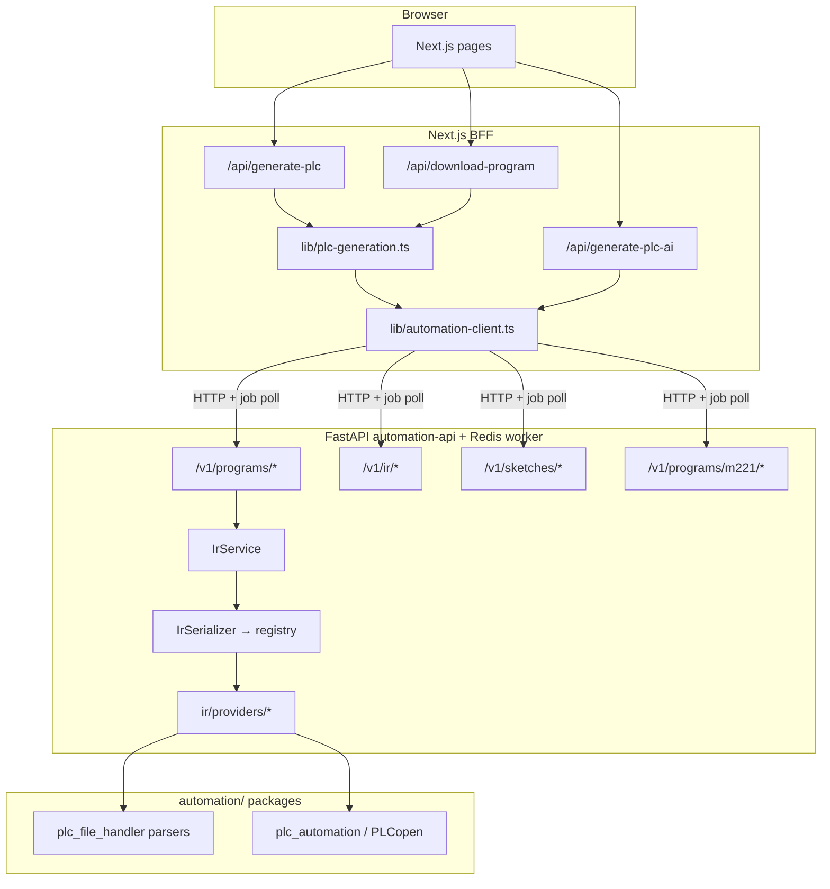
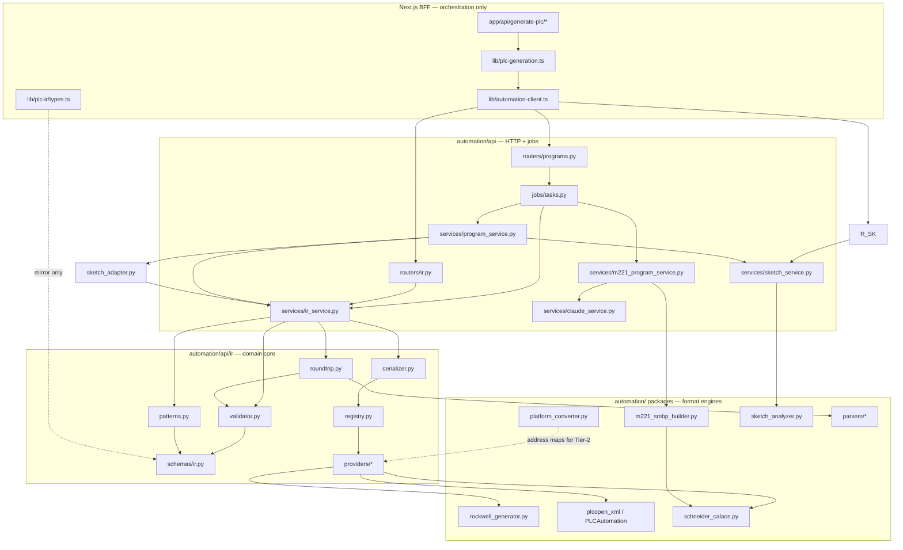

# Phase 4 — Platform Integrations

> **Status:** v1.5 platform sprint **COMPLETE** (through **4b′**, 2026-06-14).  
> **Next:** [PHASE_5_IMPLEMENTATION.md](PHASE_5_IMPLEMENTATION.md) — Phase 5: IDE sign-off, export expansion, arbitrary logic.  
> **Companion docs:** [FASTAPI_AUTOMATION_SERVICE.md](FASTAPI_AUTOMATION_SERVICE.md), [PHASE_5_IMPLEMENTATION.md](PHASE_5_IMPLEMENTATION.md).

---

## For humans and Cursor agents

| Question | Answer |
|----------|--------|
| What is Phase 4? | Real, importable PLC export per vendor + the logic pipeline that feeds it. |
| What is done? | Full §7.0 sprint: IR, 6 patterns, Claude→IR, Tier-2 (Siemens/Mitsubishi), Schneider Calaos unification, golden CI, sketch→IR, provider registry, BFF wire-up. **159 pytest** + **20 BFF tests**. |
| What is **not** done (vNext)? | Real IDE import sign-off, full L5X XSD, arbitrary NL→logic, Tier-2/PLCopen for all patterns. See [PHASE_5_IMPLEMENTATION.md](PHASE_5_IMPLEMENTATION.md). |
| Where is the code? | Python: `automation/api/ir/` (registry, providers, patterns, sketch_adapter), `automation/api/schemas/ir.py`. BFF: `lib/plc-generation.ts`, `lib/automation-client.ts`. TS types: `lib/plc-ir/types.ts`. |
| Do **not** reintroduce | TS string-template generators, `spawn('python3', …)` from app routes, fabricated `<ProjectDescriptor>` `.smbp` on live paths. |
| Is billing in scope? | **No.** Frozen — see [PHASE_5_IMPLEMENTATION.md §5](PHASE_5_IMPLEMENTATION.md#5-frozen-tracks-auth-integrations-billing). |
| Where does Phase 5 work live? | [PHASE_5_IMPLEMENTATION.md](PHASE_5_IMPLEMENTATION.md) — post–v1.5 implementation plan. |

**Naming note:** “FastAPI Phase 4” (AI M221 route) and “Platform Integrations Phase 4” (this doc) are different scopes. FastAPI Phase 4 = M221 AI pipeline. This doc’s sub-phases 4a–4g = vendor export depth.

---

## 1. Goal & definition of "done"

Today the app generates files through **validated Python IR → provider registry → vendor export** behind the FastAPI automation service. **§7.0 is complete** for v1.5. The **vNext** goal remains: user opens the downloaded file in the vendor IDE with **zero import errors** — verified manually per platform (not yet done).

**Acceptance criteria (per platform — unchanged):**
1. The exported file opens/imports in the target IDE with **zero import errors**.
2. The program **compiles** in that IDE.
3. I/O, timers, counters, and the core logic match the user's request.
4. Safety scaffolding (E-stop, seal-in) is present where applicable.
5. A round-trip parse (export → parse back) reproduces the same logical structure.

**v1.5 validation bar (implemented):** schema/well-formedness + **round-trip parse in CI** (`automation/api/tests/test_ir.py`).  
**Next-version gate:** real IDE import sign-off (Studio 5000, EcoStruxure, TIA, GX Works). See [PHASE_5_IMPLEMENTATION.md](PHASE_5_IMPLEMENTATION.md).

If a platform cannot meet (1)–(2) with an open format, we say so explicitly and ship the best *importable source* we can (see feasibility tiers below).

---

## 2. State of the codebase

### 2a. Historical audit (pre–FastAPI migration)

Before 2026-06-14 the live app had **two parallel, unmerged export stacks**:

**Next.js generators (removed from runtime path):**
- `app/api/generate-plc/generators/{schneider,siemens,rockwell,generic}.ts` — regex + string templates; **deprecated stubs** that throw if called.
- `app/api/generate-plc-ai/route.ts` — previously inlined `generateSmbpXml()` with fabricated `<ProjectDescriptor>` schema.
- `app/api/download-program/route.ts` — previously ~410 lines of per-platform TS approximations.

**Critical mismatch (fixed for M221 AI path):** fabricated `.smbp` used `<ProjectDescriptor>`, but real EcoStruxure files (`automation/samples/tankcontrol.smbp`) use Calaos/Case 2.0 XML. M221 AI now builds Calaos XML via `automation/api/services/m221_smbp_builder.py`.

**Python (offline capability, now primary runtime):**
- `plc_file_handler/generators/` — Schneider ZIP `.smbp`, Rockwell `.L5X`.
- `plc_automation/plcopen_xml.py` — PLCopen TC6 (`samples/MotorControl_Universal.xml`).
- Previously reached only via `spawn('python3', cli.py …)` from sketch routes.

### 2b. Current as-built (after FastAPI Phases 0–5)



| Layer | Path | Role today |
|-------|------|------------|
| **IR schema (Python)** | `automation/api/schemas/ir.py` | `PlcProgram`, timers/counters, `PlcMeta` |
| **Pattern library** | `automation/api/ir/patterns.py` | 6 patterns → `PlcProgram` |
| **Claude → IR** | `claude_ir_service.py`, `pattern_match.py` | Validated IR + pattern fallback |
| **Sketch → IR** | `ir/sketch_adapter.py` | SketchAnalyzer JSON → `PlcProgram` |
| **Validator** | `automation/api/ir/validator.py` | Symbols, timers, pattern rules, E-stop |
| **Provider registry** | `ir/registry.py`, `ir/providers/*` | Vendor serialize lookup |
| **Serializer** | `automation/api/ir/serializer.py` | Thin delegate to registry |
| **Round-trip** | `automation/api/ir/roundtrip.py` | Export → parse → symbol match |
| **Golden CI** | `api/tests/fixtures/`, `test_golden_*.py` | IR + export hash regression |
| **IR HTTP API** | `automation/api/routers/ir.py` | patterns, validate, serialize, Claude IR jobs |
| **Program API** | `program_service.py` | pattern / ir / claude_ir / sketch_analysis → file + `metadata.ir` |
| **M221 AI** | `m221_program_service.py` | Claude→IR→`m221_adapter`→Calaos `.smbp` + `metadata.ir` |
| **TS IR types** | `lib/plc-ir/types.ts` | BFF mirror only |
| **BFF** | `lib/plc-generation.ts`, `lib/automation-client.ts` | Orchestration, no vendor templates |
| **Persistence** | `generation_parameters` | `ir`, `programData`, `downloadParams` |

**Live routes (no TS template generation):**
- `POST /api/generate-plc` → `/v1/programs/generate` or `/v1/programs/plcopen`
- `POST /api/download-program` → `regeneratePlcDownload()`
- `POST /api/generate-plc-ai` → `/v1/programs/m221/generate`
- `POST /api/analyze-sketch` → `/v1/sketches/analyze`
- `POST /api/generate-from-sketch` → `/v1/sketches/generate` (binary default; `include_metadata=true` → JSON + `ir`)

**Deprecated (guard rails only):**
- `app/api/generate-plc/generators/*.ts` — throw on call
- `lib/claude.ts` — deprecated; Anthropic in Python only
- `automation/plc_automation/create_*_smbp.py` — offline scripts; not live HTTP path

### 2c. Format detection (`automation/plc_file_handler/utils/format_detector.py`)

| Platform | Extensions detected |
|----------|---------------------|
| schneider | `.smbp`, `.xml` |
| siemens | `.ap15–19`, `.zap15–17`, `.scl` |
| rockwell | `.acd`, `.l5x`, `.l5k` |
| mitsubishi | `.gxw`, `.gx2`, `.gx3` |
| codesys | `.project`, `.export` |
| generic | `.st`, `.ld`, `.xml` |

---

## 3. Vendor format feasibility (unchanged)

Not every vendor has an open, writable interchange format. This drives scope.

| Platform | Open importable format | Native project | Verdict |
|----------|------------------------|----------------|---------|
| **Rockwell** | **`.L5X` (documented XML)** | `.acd` (binary) | ✅ **Tier 1** |
| **CODESYS / "universal"** | **PLCopen TC6 `.xml`** | `.project` (binary) | ✅ **Tier 1** |
| **Schneider** | **`.smbp` (Calaos/Case XML or ZIP)** | — | ✅ **Tier 1** |
| **Siemens** | `.scl` source; PLCopen partial | `.ap*/.zap*` | ⚠️ **Tier 2** |
| **Mitsubishi** | IL/ST + device-comment CSV | `.gxw/.gx*` | ⚠️ **Tier 2** |

Native binaries (`.acd`, `.zap`, `.gxw`) require the vendor toolchain on Windows and are **out of scope** for v1.5.

---

## 4. Architecture (updated decisions)

### Decision D1 — Platform-neutral Intermediate Representation (IR) — **IMPLEMENTED (Python)**

Generate logic once into a vendor-neutral IR, then serialize per vendor. **Canonical IR lives in Python** (`automation/api/schemas/ir.py`). TypeScript mirrors the shape in `lib/plc-ir/types.ts` for the BFF only.

```python
# automation/api/schemas/ir.py (canonical)
class PlcProgram(BaseModel):
    name: str
    target: PlcTarget          # vendor + model
    vars: list[PlcVar]
    pous: list[Pou]             # networks with LogicNode trees
    meta: PlcMeta              # pattern, patternParams, ...
```

Logic nodes: `contact`, `coil`, `and`, `or`, `not` — sufficient for LD-oriented patterns today; extend for timers/counters/ST as needed in 4e/4f.

### Decision D2 — Serializer runtime — **SUPERSEDED → D2′**

| | Original D2 (2026-06-14) | **D2′ (approved)** |
|--|---------------------------|---------------------|
| Runtime serializers | TypeScript in Next.js | **Python in FastAPI** (`IrSerializer` + existing generators) |
| TS role | Primary export | **Types + HTTP client only** (`lib/plc-ir/types.ts`) |
| Python role | CI round-trip validator only | **Single source of truth** for generate/parse/serialize |
| Deploy | Avoid runtime Python | **Docker Compose:** `automation-api` + `automation-worker` + Redis |

See [FASTAPI_AUTOMATION_SERVICE.md §4.3](FASTAPI_AUTOMATION_SERVICE.md) for full rationale. Cloud deploy requires a Python sidecar; Next.js never shells out.

### Decision D1b — Extensible provider registry — **IMPLEMENTED**

Adding a vendor is drop-in via `automation/api/ir/registry.py` and `ir/providers/`. `IrSerializer` delegates to `get_provider(vendor)` — no vendor if/else chain.

```python
# automation/api/ir/registry.py
class PlatformProvider(Protocol):
    vendor: PlcVendor
    def serialize(self, program: PlcProgram) -> dict[str, Any]: ...

register_provider("schneider", SchneiderCalaosProvider())
# … rockwell, siemens, mitsubishi, codesys, generic (plcopen)
```

See `test_ir_registry.py` for completeness checks.

### Decision D3 — Logic generation pipeline — **IMPLEMENTED (v1.5 scope)**

```
user request (NL + I/O + model)
      │
      ▼
[1] Pattern library (6 deterministic patterns)     ✅ ir/patterns.py
      ▼ (if no exact pattern / Claude fails)
[2] Claude → IR + pattern fallback                  ✅ claude_ir_service.py, pattern_match.py
      ▼
[3] Sketch → IR (vision path)                     ✅ sketch_adapter.py → IrSerializer
      ▼
[4] IR validation + safety pass                     ✅ validate_program(); E-stop rules
      ▼
[5] Provider registry → vendor export               ✅ Tier 1 + Tier 2 providers
      ▼
[6] Format validation (CI)                          ✅ round-trip + golden hashes (4h)
```

- **M221 AI path:** Claude → IR → `m221_adapter` → Calaos `.smbp` + `metadata.ir`.
- **vNext (not v1.5):** free-form arbitrary-logic synthesis → [PHASE_5_IMPLEMENTATION.md §2](PHASE_5_IMPLEMENTATION.md#2-phase-5-recommended-work-priority-order).

### Decision D4 — Validation & verification — **v1.5 CI complete; IDE gate deferred**

| Check | Status |
|-------|--------|
| IR schema validation | ✅ `POST /v1/ir/validate`, `validate_program()` |
| Round-trip export → parse | ✅ Full matrix incl. 4j patterns, sketch, Tier-2 |
| PLCopen structure | ✅ `test_plcopen_golden.py` vs golden sample |
| L5X structural validation | ✅ `test_l5x_schema.py` (well-formed + parser); full XSD → vNext |
| Calaos `.smbp` | ✅ Parser round-trip + golden export hashes |
| Golden export regression | ✅ `test_golden_exports.py` (7 baseline cases) |
| **Real IDE import** | ⏳ **vNext** — manual lab (Studio 5000, EcoStruxure, TIA, GX Works) |

---

## 5. Per-platform plan (status)

| Platform | Plan | Status | Notes |
|----------|------|--------|-------|
| **Rockwell `.L5X`** | IR → `RockwellProvider` | ✅ **Done** | `ir/providers/rockwell.py`; round-trip in CI |
| **PLCopen / CODESYS** | IR → `PlcopenProvider` | ✅ **Done** | `motor_startstop` only; `/v1/programs/plcopen` |
| **Schneider `.smbp`** | IR → Calaos/Case 2.0 | ✅ **Done** | `schneider_calaos.py` — motor, sequential, sketch, M221 |
| **Siemens** | Tier-2 `.scl` | ✅ **Done** | Motor-like patterns; not full TIA project |
| **Mitsubishi** | Tier-2 IL/ST/CSV ZIP | ✅ **Done** | Motor-like patterns; not `.gxw` |
| **Wire-up** | Single path + persist IR | ✅ **Done** | All routes → FastAPI; `metadata.ir` on generate paths |

### 5.1 Rockwell `.L5X` — Tier 1
- **Implemented:** `RockwellProvider` + `rockwell_generator.py`.
- **vNext:** Full L5X XSD in CI; IDE import sign-off.

### 5.2 CODESYS / generic PLCopen — Tier 1
- **Implemented:** `PlcopenProvider` / `PLCAutomation`.
- **vNext:** PLCopen export for patterns beyond `motor_startstop`.

### 5.3 Schneider `.smbp` — Tier 1
- **Implemented:** Unified IR → Calaos via `schneider_calaos.py` (4d′).
- **vNext:** EcoStruxure IDE import sign-off.

### 5.4 Siemens — Tier 2
- **Implemented:** SCL source import for motor-like patterns (4f-1).
- **Out of scope:** TIA `.ap*` / `.zap*` native projects.

### 5.5 Mitsubishi — Tier 2
- **Implemented:** IL/ST/CSV ZIP for motor-like patterns (4f-2).
- **Out of scope:** GX Works `.gxw` native projects.

### 5.6 Wire-up
- ✅ All BFF generate/download routes use FastAPI.
- ✅ IR persisted on pattern, Claude, M221, and sketch (`include_metadata`) paths.

---

## 6. Implementation sub-phases (status)

Original order **4a → 4b → 4c → 4d → 4e → 4f → 4g**. FastAPI Phases 0–5 delivered much of 4a–4d and 4g in **Python**, not TS.

| Sub-phase | Deliverable | Status | Verify / location |
|-----------|-------------|--------|-------------------|
| **4a** | IR types + pattern library + validator | ✅ Done | `schemas/ir.py`, `ir/patterns.py`, `ir/validator.py`; `test_ir.py` |
| **4b** | Rockwell `.L5X` serializer | ✅ Done (Python) | `ir/providers/rockwell.py`; `test_ir.py` round-trip |
| **4c** | PLCopen serializer | ✅ Done (Python) | `ir/providers/plcopen.py`; `test_plcopen_golden.py` |
| **4d** | Schneider Calaos (correct schema) | ✅ Done | Unified via `schneider_calaos.py` (4d′) |
| **4e** | Claude→IR + schema validation + pattern fallback | ✅ Done (4e-1…4e-3) | `claude_ir` on `/v1/programs/generate`; M221 via `ClaudeIrService` + `m221_adapter` |
| **4f** | Siemens SCL/PLCopen + Mitsubishi IL/CSV | ✅ Done (4f-1…4f-3) | Tier-2 native exports wired through `/generator` BFF |
| **4g** | Route consolidation; persist IR | ✅ Done | `lib/plc-generation.ts`, routes, `generation_parameters.ir` |
| **4b′** | Extensible provider registry (D1b) | ✅ Done | `ir/registry.py`, `ir/providers/*`, `test_ir_registry.py` |

**Recommended next implementation order:** §7.0 is **complete**. New work → [PHASE_5_IMPLEMENTATION.md](PHASE_5_IMPLEMENTATION.md).

> **Detailed plan:** See [§7 Phase-wise implementation plan](#7-phase-wise-implementation-plan). **Backlog mapping:** [§7.16](#716-backlog-alignment-no-surprises).

---

## 7. Phase-wise implementation plan

This section is the **execution blueprint** for Platform Integrations work. The FastAPI foundation (Phases 0–5) and §7.0 sprint are **complete** (2026-06-14). Use this as historical reference; new work → [PHASE_5_IMPLEMENTATION.md](PHASE_5_IMPLEMENTATION.md).

### 7.0 Roadmap at a glance

| Phase | Name | Priority | Depends on | Status |
|-------|------|----------|------------|--------|
| **4a** | IR core + patterns + validator | — | FastAPI 0–5 | ✅ Done |
| **4b** | Rockwell `.L5X` serializer | — | 4a | ✅ Done |
| **4c** | PLCopen serializer | — | 4a | ✅ Done |
| **4g** | BFF routes + IR persistence | — | 4a, 4b, 4c | ✅ Done |
| **4d** | Schneider Calaos | P2 | 4a | ✅ Done |
| **4e-1** | IR schema extensions | P0 | 4a | ✅ Done |
| **4e-2** | Claude → IR service | P0 | 4e-1 | ✅ Done |
| **4e-3** | Program API + M221 alignment | P0 | 4e-2 | ✅ Done |
| **4f-1** | Siemens SCL serializer | P1 | 4e-1 (min), 4a | ✅ Done |
| **4f-2** | Mitsubishi IL/CSV serializer | P1 | 4e-1 (min), 4a | ✅ Done |
| **4f-3** | Tier-2 BFF + download path | P1 | 4f-1 or 4f-2 | ✅ Done |
| **4d′** | Schneider Calaos unification | P2 | 4e-1, 4d partial | ✅ Done |
| **4h** | Validation hardening (XSD, fixtures) | P2 | 4b, 4c, 4d′ | ✅ Done |
| **4i** | Sketch analysis → IR | P3 | 4e-2, 4d′ | ✅ Done |
| **4j** | Pattern library expansion | P3 | 4e-1 | ✅ Done |
| **4b′** | Provider registry refactor | P3 | 4f-1, 4f-2, 4d′ | ✅ Done |

**Recommended execution order (completed):** `4e-1 → 4e-2 → 4e-3 → 4f-1 → 4f-2 → 4f-3 → 4d′ → 4h → (4j ∥ 4i) → 4b′`

Phases **4j** and **4i** ran in parallel after **4e-3**; both depended on extended IR from **4e-1**.

---

### 7.1 Module dependency map

Understanding **which module imports which** prevents circular changes and wrong-layer edits.



#### Layer rules (agents must follow)

| Layer | May import | Must not |
|-------|------------|----------|
| **BFF** (`lib/*`, `app/api/*`) | `automation-client`, `plc-generation`, `plc-ir/types` | Python packages, vendor XML logic, Anthropic SDK |
| **Routers** | Services, schemas, `JobStore` | Generator internals directly |
| **Services** | `ir/*`, `schemas/*`, `plc_file_handler/*`, `plc_automation/*` | Next.js |
| **IR** (`api/ir/*`) | `schemas/ir.py`, generators/parsers | Routers, Redis, Anthropic |
| **Generators** (`plc_file_handler/*`) | stdlib, ElementTree | FastAPI, Pydantic IR (keep generators dumb) |

#### Critical dependency edges

| Consumer | Provider | Notes |
|----------|----------|-------|
| `ProgramService.generate()` | `IrService` + `ClaudeIrService` + `sketch_adapter` | pattern, `ir`, `claude_ir`, `sketch_analysis` |
| `IrService.serialize()` | `IrSerializer` → `registry.get_provider()` | Single entry for file bytes |
| `SchneiderCalaosProvider` | `ir/serializers/schneider_calaos.py` | All Schneider IR exports |
| `RockwellProvider` | `rockwell_generator.py` | Sequential lights rebuilds pattern IR first |
| `SiemensSclProvider` / `MitsubishiProvider` | `ir/serializers/*.py` | Tier-2 motor-like patterns |
| `PlcopenProvider` | `PLCAutomation` | `codesys` + `generic`; motor_startstop only |
| `M221ProgramService` | `ClaudeIrService` → `m221_adapter` → `M221SmbpBuilder` | Returns `metadata.ir` |
| `SketchService` / CLI `--from-sketch` | `sketch_adapter` → `IrSerializer` | Same IR path as ProgramService |
| `roundtrip.assert_roundtrip()` | Parsers + `validate_program()` | CI quality gate |

---

### 7.2 Completed foundation (4a, 4b, 4c, 4g) — reference

No further work unless a regression is found. Use as the pattern for new phases.

| Phase | Key deliverables | Tests |
|-------|------------------|-------|
| **4a** | `schemas/ir.py`, `ir/patterns.py`, `ir/validator.py`, `routers/ir.py`, `IrService` | `test_ir.py` (patterns, validator) |
| **4b** | `ir/providers/rockwell.py` | Round-trip matrix `.L5X` |
| **4c** | `ir/providers/plcopen.py`, `ProgramService.generate_plcopen` | Golden PLCopen markers |
| **4g** | `lib/plc-generation.ts`, route persistence, deprecated TS generators | `npm run test:plc`, E2E generate/download |

---

### 7.3 Phase 4e-1 — IR schema extensions

**Goal:** Extend `PlcProgram` so Claude and new patterns can express timers, counters, and safety logic without ad-hoc JSON schemas.

**Depends on:** 4a ✅  
**Unblocks:** 4e-2, 4f-1, 4f-2, 4j

#### Tasks

| # | Task | Files |
|---|------|-------|
| 1 | Add optional `TimerNode`, `CounterNode` (or document timer vars + `dataType: TON` only for v1) | `automation/api/schemas/ir.py` |
| 2 | Extend `validate_program()` — timer symbols referenced in logic, E-stop pattern rules (optional flag) | `automation/api/ir/validator.py` |
| 3 | Mirror type changes | `lib/plc-ir/types.ts` |
| 4 | Add JSON Schema export or Pydantic `model_json_schema()` for Claude prompts | `automation/api/ir/schema_export.py` (new) |
| 5 | Unit tests for new node types and validation failures | `automation/api/tests/test_ir.py` |

#### Acceptance criteria

- [x] Extended IR validates existing `motor_startstop` / `sequential_lights` without changes
- [x] Invalid timer references raise `IrValidationError` with actionable messages
- [x] TS types compile (`npm run build`)
- [x] `GET /v1/ir/schema` returns JSON Schema for Claude (4e-2 prep)

#### Verify

```bash
cd automation && uv run pytest api/tests/test_ir.py -v
npm run build
```

---

### 7.4 Phase 4e-2 — Claude → IR service

**Goal:** Claude returns **`PlcProgram` JSON**, validated and normalized — not vendor-specific text or M221-only JSON.

**Depends on:** 4e-1, `ClaudeService` ✅  
**Unblocks:** 4e-3, 4i

#### Tasks

| # | Task | Files |
|---|------|-------|
| 1 | Create `ClaudeIrService` with system prompt grounded in IR JSON Schema | `automation/api/services/claude_ir_service.py` (new) |
| 2 | `generate_program_ir(description, vendor, model)` → `PlcProgram` | same |
| 3 | Retry loop: invalid IR → re-prompt with validation errors (max 2 retries) | same |
| 4 | Pattern fallback: map NL keywords → `build_pattern()` when Claude fails or confidence low | `automation/api/ir/pattern_match.py` (new) or inline in service |
| 5 | Job type `program.claude_ir` | `automation/api/jobs/tasks.py` |
| 6 | Optional sync endpoint `POST /v1/ir/generate-from-description` (or under `/v1/programs/`) | `automation/api/routers/ir.py` or `programs.py` |
| 7 | Tests with mocked Claude returning valid/invalid JSON | `automation/api/tests/test_claude_ir.py` (new) |

#### Dependencies (runtime)

```
ClaudeIrService
  → ClaudeService.ask_json()
  → validate_program()          # ir/validator.py
  → build_pattern() [fallback]  # ir/patterns.py
```

#### Acceptance criteria

- [x] Valid fixture description produces `PlcProgram` passing `validate_program()`
- [x] Invalid Claude output triggers retry then pattern fallback (never raw vendor XML)
- [x] No Anthropic imports outside `automation/api/services/`
- [x] `POST /v1/ir/generate-from-description` async job (`program.claude_ir`)

#### Verify

```bash
cd automation && uv run pytest api/tests/test_claude_ir.py -v
```

---

### 7.5 Phase 4e-3 — Program API + M221 alignment

**Goal:** Expose Claude→IR through `/v1/programs/generate`; persist IR from AI paths; reduce duplicate M221 JSON schema.

**Depends on:** 4e-2, 4g ✅  
**Unblocks:** 4i, unified AI generator UX

#### Tasks

| # | Task | Files |
|---|------|-------|
| 1 | Add `ClaudeIrSource` to program request schema | `automation/api/schemas/programs.py` |
| 2 | `ProgramService.generate()` branch: `source.type == "claude_ir"` | `automation/api/services/program_service.py` |
| 3 | Return `metadata.ir` on Claude path (same as pattern path) | same |
| 4 | **Strategy A:** M221 `/m221/generate` calls `ClaudeIrService` → `ir/m221_adapter.py` → `M221SmbpBuilder` | `m221_program_service.py`, `ir/m221_adapter.py` |
| 4alt | **Strategy B:** Keep M221 builder; add parallel IR export for debugging only | lower priority |
| 5 | Persist `generationParameters.ir` from `/api/generate-plc-ai` | `app/api/generate-plc-ai/route.ts` |
| 6 | Client helper `generateProgramFromDescription()` | `lib/automation-client.ts` |
| 7 | API tests for new source type | `automation/api/tests/test_programs_api.py` |

#### Acceptance criteria

- [x] `POST /v1/programs/generate` with `claude_ir` source returns file + `metadata.ir`
- [x] M221 AI page still downloads valid Calaos `.smbp` (regression)
- [x] Signed-in user gets `ir` in `generation_parameters` for AI path

#### Verify

```bash
cd automation && uv run pytest api/tests -v
# Manual: /m221-generator + /generator with NL description
```

---

### 7.6 Phase 4f-1 — Siemens SCL serializer

**Goal:** Tier-2 export: importable `.scl` from `PlcProgram` IR (motor start/stop first).

**Depends on:** 4a ✅, 4e-1 (recommended for address rules)  
**Unblocks:** 4f-3, 4b′

#### Tasks

| # | Task | Files |
|---|------|-------|
| 1 | Implement `_serialize_siemens_scl()` — IR vars → SCL VAR block; networks → ST/LD-ish SCL body | `automation/api/ir/serializers/siemens_scl.py` (new) or method on `IrSerializer` |
| 2 | Use `PlatformConverter` address maps (`schneider_to_siemens`) for `%I` → `I` | `plc_file_handler/converters/platform_converter.py` |
| 3 | Wire `vendor == "siemens"` in `IrSerializer.serialize()` | `automation/api/ir/serializer.py` |
| 4 | Extend `PlatformName` in program schema if native Siemens generate requested | `automation/api/schemas/programs.py` |
| 5 | Round-trip: parse exported SCL with `SiemensParser` (symbol presence) | `automation/api/ir/roundtrip.py`, `test_ir.py` |
| 6 | Label output metadata `format: "scl"`, `tier: 2` | serializer metadata |

#### Acceptance criteria

- [x] Motor start/stop IR → `.scl` with `START_BTN`, `STOP_BTN`, `MOTOR_RUN` symbols
- [x] File header comment states "source import, not a TIA project"
- [x] pytest round-trip passes (symbol-level)

#### Verify

```bash
cd automation && uv run pytest api/tests/test_ir.py -k siemens -v
```

---

### 7.7 Phase 4f-2 — Mitsubishi IL/CSV serializer

**Goal:** Tier-2 export: IL or ST program text + device-comment CSV for GX Works import.

**Depends on:** 4a ✅, 4e-1  
**Unblocks:** 4f-3, 4b′

#### Tasks

| # | Task | Files |
|---|------|-------|
| 1 | `_serialize_mitsubishi_il()` and `_serialize_mitsubishi_csv()` | `automation/api/ir/serializers/mitsubishi.py` (new) |
| 2 | Address mapping via `schneider_to_mitsubishi` | `platform_converter.py` |
| 3 | Wire `vendor == "mitsubishi"` — return ZIP or paired files policy (document choice) | `serializer.py` |
| 4 | Round-trip via `MitsubishiParser` where applicable | `roundtrip.py`, tests |
| 5 | Metadata `tier: 2`, `format: "il"` / `"csv"` |

#### Acceptance criteria

- [x] Motor pattern exports importable IL/ST + CSV comments
- [x] Limitations documented in API response metadata / RUNBOOK

#### Verify

```bash
cd automation && uv run pytest api/tests/test_ir.py -k mitsubishi -v
```

---

### 7.8 Phase 4f-3 — Tier-2 BFF + download path

**Goal:** Siemens/Mitsubishi users on `/generator` get real exports via FastAPI (today: PLCopen fallback for motor only).

**Depends on:** 4f-1 or 4f-2, 4g ✅  
**Unblocks:** None (Tier-2 complete)

#### Tasks

| # | Task | Files |
|---|------|-------|
| 1 | Add `resolveTier2Platform()` or extend `generatePlcProgramFile()` | `lib/plc-generation.ts` |
| 2 | Call `/v1/programs/generate` with `platform: siemens \| mitsubishi` | `lib/automation-client.ts` |
| 3 | Update `PlcDownloadParams` if new fields needed | `lib/plc-generation.ts`, DB persistence |
| 4 | UI copy: "source import" disclaimer on generator preview | generator page(s) |
| 5 | BFF tests | `lib/plc-generation.test.ts` |

#### Acceptance criteria

- [x] Selecting Siemens/Mitsubishi + motor logic downloads `.scl` or IL/CSV (not generic ST stub)
- [x] `npm run test:plc` and `npm run build` pass

---

### 7.9 Phase 4d′ — Schneider Calaos unification

**Goal:** One IR → Calaos/Case 2.0 path for **all** Schneider exports (motor, sequential, AI).

**Depends on:** 4a ✅, 4e-1 (for shared element rendering), partial 4d  
**Unblocks:** 4h (consistent parser), 4b′

#### Resolved (4d′ ✅)

| Path (historical) | Was | Now |
|------|-----|-----|
| Motor pattern | ZIP `.smbp` via `schneider_generator` | IR → `schneider_calaos.py` |
| Sequential | `PLCProgramGenerator` + template | IR → `schneider_calaos.py` |
| M221 AI | Separate builder only | Claude→IR→adapter→shared Calaos builder |

#### Tasks (completed)

| # | Task | Files |
|---|------|-------|
| 1 | Extract shared Calaos XML builder from `m221_smbp_builder.py` | `automation/api/ir/serializers/schneider_calaos.py` (new) |
| 2 | Implement IR walk: `PlcProgram` → Calaos `POU` / `localVars` / rungs | same |
| 3 | Replace `_serialize_schneider()` ZIP path for patterns with Calaos (or feature-flag) | `serializer.py` |
| 4 | Point sequential template path to same builder with `pattern=sequential_lights` | `serializer.py` |
| 5 | Refactor `M221SmbpBuilder` to delegate to shared builder OR convert M221 JSON → `PlcProgram` first | `m221_smbp_builder.py`, `m221_program_service.py` |
| 6 | Update `SchneiderParser` if new XML structures appear | `parsers/schneider_parser.py` |
| 7 | Expand round-trip matrix — all Schneider paths `ok: true` | `test_ir.py` |

#### Acceptance criteria

- [x] Motor + sequential + M221 AI all produce Calaos-namespace XML matching `tankcontrol.smbp` structure
- [x] Single code path for Calaos serialization (≤2 thin adapters)
- [x] Full pytest suite green

#### Verify

```bash
cd automation && uv run pytest api/tests/test_ir.py api/tests/test_m221.py -v
# Compare structure to automation/samples/tankcontrol.smbp
```

---

### 7.10 Phase 4h — Validation hardening

**Goal:** Stronger CI gates beyond symbol round-trip.

**Depends on:** 4b, 4c, 4d′ (stable bytes)  
**Unblocks:** Confidence for production; IDE sign-off prep

#### Tasks

| # | Task | Files |
|---|------|-------|
| 1 | Golden IR fixtures JSON | `automation/api/tests/fixtures/ir/*.json` |
| 2 | Golden export snapshots (or hashed bytes) per format | `automation/api/tests/fixtures/exports/` |
| 3 | L5X well-formedness / optional XSD check script | `automation/api/tests/test_l5x_schema.py` |
| 4 | PLCopen structure diff vs `MotorControl_Universal.xml` | existing + extend |
| 5 | CI documentation in RUNBOOK | `docs/RUNBOOK.md` |

#### Acceptance criteria

- [x] Regression: unintended serializer change fails CI
- [x] Documented command for local golden update

---

### 7.11 Phase 4i — Sketch analysis → IR

**Goal:** Sketch pipeline produces `PlcProgram`, not direct `SchneiderGenerator` calls.

**Depends on:** 4e-2, 4d′ (Schneider serialize)  
**Unblocks:** Vision → any vendor via IR

#### Tasks

| # | Task | Files |
|---|------|-------|
| 1 | `sketch_analysis_to_ir(analysis) -> PlcProgram` | `automation/api/ir/sketch_adapter.py` (new) |
| 2 | `SketchService` / `ProgramService._generate_from_sketch_analysis` use `IrService.serialize()` | `sketch_service.py`, `program_service.py` |
| 3 | Return `metadata.ir` on sketch generate routes | services + BFF if exposed |
| 4 | Tests with fixture analysis JSON | `test_sketch_ir.py` |

#### Current bypass (to remove)

```
ProgramService._generate_from_sketch_analysis
  → SchneiderGenerator / RockwellGenerator directly   # no IR
```

#### Target flow

```
SketchAnalyzer → sketch_adapter → PlcProgram → IrSerializer → file
```

#### Acceptance criteria

- [x] `sketch_analysis_to_ir()` in `ir/sketch_adapter.py`
- [x] `ProgramService` and `SketchService` serialize via `IrService` (no direct generator bypass)
- [x] `metadata.ir` returned on sketch generate paths
- [x] Fixture-based tests in `test_sketch_ir.py`

---

### 7.12 Phase 4j — Pattern library expansion

**Goal:** Add vetted deterministic patterns before widening Claude scope.

**Depends on:** 4e-1  
**Unblocks:** Better fallback for 4e-2; richer demos

#### Candidate patterns (priority order)

1. `estop_motor` — E-stop NC in series with motor seal-in  
2. `tank_level` — low/high interlocks (reference: `tankcontrol.smbp` semantics)  
3. `conveyor_startstop` — start/stop + run signal  
4. `traffic_lights` — timed sequence (extends sequential)

#### Acceptance criteria

- [x] `estop_motor`, `tank_level`, `conveyor_startstop`, `traffic_lights` in `PATTERN_CATALOG` and `GET /v1/ir/patterns`
- [x] Pattern-specific validation in `ir/validator.py`
- [x] Round-trip matrix rows in `test_patterns_4j.py`
- [x] NL detection in `pattern_match.py` and `lib/plc-generation.ts`

#### Tasks per pattern

| # | Task | Files |
|---|------|-------|
| 1 | `build_pattern("name", ...)` | `ir/patterns.py` |
| 2 | Pattern-specific validation rules | `ir/validator.py` |
| 3 | Register in `PATTERN_CATALOG` + `GET /v1/ir/patterns` | `patterns.py`, router |
| 4 | Serializer: use generic IR walk (post-4d′) or template | `serializer.py` |
| 5 | Round-trip test row in matrix | `test_ir.py` |
| 6 | Optional: `detectPatternFromLogic()` in BFF | `lib/plc-generation.ts` |

---

### 7.13 Phase 4b′ — Provider registry refactor

**Goal:** Drop-in vendor registration without editing `IrSerializer.serialize()` if/else chain.

**Depends on:** 4f-1, 4f-2, 4d′ (all providers known)  
**Unblocks:** Faster addition of future vendors

#### Tasks

| # | Task | Files |
|---|------|-------|
| 1 | Define `PlatformProvider` protocol + `register_provider()` | `automation/api/ir/registry.py` |
| 2 | Register rockwell, schneider_calaos, plcopen, siemens_scl, mitsubishi | `automation/api/ir/providers/*.py` |
| 3 | `IrSerializer.serialize()` → lookup by `program.target.vendor` | `serializer.py` |
| 4 | Tests: provider list completeness | `test_ir_registry.py` |

#### Acceptance criteria

- [x] `PlatformProvider` protocol + `register_provider()` in `ir/registry.py`
- [x] Built-in providers: schneider, rockwell, siemens, mitsubishi, codesys, generic
- [x] `IrSerializer.serialize()` delegates to registry lookup
- [x] `test_ir_registry.py` — provider completeness + serialize parity

---

### 7.14 Cross-cutting checklist (every phase)

Before marking any phase complete:

- [ ] `cd automation && uv run pytest api/tests -v` — all pass  
- [ ] `npm run test:plc && npm run build` — pass if BFF touched  
- [ ] `lib/plc-ir/types.ts` synced if `schemas/ir.py` changed  
- [ ] `docs/RUNBOOK.md` phase log updated  
- [ ] No new `spawn('python3')` or TS vendor templates  
- [ ] Billing / Stripe untouched  

---

### 7.15 Agent quick-start (vNext work)

1. Read [PHASE_5_IMPLEMENTATION.md §2](PHASE_5_IMPLEMENTATION.md#2-phase-5-recommended-work-priority-order) — pick the highest-priority item the user requested.  
2. Read §7.1 — confirm you are editing the **correct layer**.  
3. Implement **one** backlog item only — **no scope creep**.  
4. Run §7.14 checklist.  
5. Update PHASE_5_IMPLEMENTATION when an item ships.

---

### 7.16 Backlog alignment (no surprises)

[PHASE_5_IMPLEMENTATION.md](PHASE_5_IMPLEMENTATION.md) is the **Phase 5 implementation plan** (scope boundaries + prioritized work + frozen tracks). §7.0 is complete; this section maps backlog items to the phases that delivered them or to explicit deferral buckets.

#### Single source of truth for order

| Document | Role |
|----------|------|
| **PHASE_4 §7.0** | Completed sprint reference — all phases ✅ |
| **PHASE_5_IMPLEMENTATION §1.5** | Known limits of v1.5 (partial scope) |
| **PHASE_5_IMPLEMENTATION §2** | Phase 5 recommended work — **implement this next** |
| **PHASE_5_IMPLEMENTATION §3** | Track B optional parallel work |
| **PHASE_5_IMPLEMENTATION §5** | **Frozen** product tracks — no accidental pull-in |

#### Backlog item → phase mapping

| Backlog item (PHASE_5_IMPLEMENTATION) | Phase | Status |
|-------------------------------------|-------|--------|
| Claude → `PlcProgram` IR | **4e-1**, **4e-2**, **4e-3** | ✅ Delivered |
| Siemens SCL + PLCopen *source* (not TIA project) | **4f-1**, **4f-3** | ✅ Delivered |
| Mitsubishi IL/ST + CSV *source* (not `.gxw`) | **4f-2**, **4f-3** | ✅ Delivered |
| Schneider export unification (3 paths → Calaos) | **4d′** | ✅ Delivered |
| L5X / PLCopen structural validation | **4h** | ✅ Delivered |
| Golden fixture bytes in repo | **4h** | ✅ Delivered |
| Expand pattern library (estop, tank, conveyor, …) | **4j** | ✅ Delivered |
| Sketch analysis → IR | **4i** | ✅ Delivered |
| Extensible provider registry (D1b) | **4b′** | ✅ Delivered |
| Activate + verify recommend/rectify Claude routes | **Track B** | vNext §3 |
| Real IDE import sign-off | **Post-sprint** | vNext §2 P0 |
| General arbitrary-logic synthesis | **Post-sprint** | vNext §2 P3 |
| Full L5X XSD validation | **Post-sprint** | vNext §2 P1 |
| Golden export hashes for 4j patterns | **Post-sprint** | vNext §2 P1 |
| Tier-2 / PLCopen for all 6 patterns | **Post-sprint** | vNext §2 P2 |
| Siemens TIA Openness / `.ap*` / `.zap*` full project | **Never** in §7 | Tier-2 source only via **4f-1** |
| Mitsubishi `.gxw` native project | **Never** in §7 | Tier-2 source only via **4f-2** |
| Native binaries (`.acd`, `.zap*`, `.gxw`) | **Never** | Out of scope |
| FBD graphical layout fidelity | **Never** | Out of scope |
| Real SAP integration | **Frozen** | Backlog §5 |
| OAuth providers | **Frozen** | Backlog §5 |
| Billing / Stripe | **Frozen** | Backlog §5 |

#### What “4e” is and is not (avoid scope creep)

| In scope (**4e-1…4e-3**) | Explicitly **not** 4e (stay in backlog) |
|--------------------------|----------------------------------------|
| Claude emits **`PlcProgram` JSON** validated by `validate_program()` | Free-form vendor text or unstructured ladder |
| Retry on validation errors; **fallback to `build_pattern()`** | General arbitrary-logic for any NL description |
| Wire `/v1/programs/generate` + optional M221 alignment | Replacing all patterns with LLM-only generation |
| Persist `metadata.ir` / `generation_parameters.ir` | Usage quotas or billing tied to generation |

#### Surprises to avoid

| If you are implementing… | Do **not** also start… | Why |
|--------------------------|------------------------|-----|
| **4e-*** | SAP, OAuth, Stripe | Unrelated product tracks; backlog §5–§7 frozen |
| **4f-*** | Full TIA / GX Works project export | Tier-2 **source** only; full project is backlog |
| **4d′** | Rewriting Rockwell/PLCopen serializers | Unification is Schneider-only |
| **4h** | IDE sign-off automation | No IDEs in CI yet; manual gate in backlog |
| **4j** | Arbitrary-logic synthesis | Patterns are deterministic + tested templates |
| Any §7 phase | TS vendor template generators | Deprecated; violates D2′ |

When a phase completes, move its backlog bullets to **PHASE_5_IMPLEMENTATION §1 Delivered** and mark the phase ✅ in §7.0.

---

## 8. Testing & data

| Layer | Command / path |
|-------|----------------|
| IR unit + round-trip | `cd automation && uv run pytest api/tests/test_ir.py api/tests/test_ir_api.py -v` |
| Program service integration | `uv run pytest api/tests/test_program_service.py -v` |
| Full automation API | `uv run pytest api/tests -v` (156+ tests) |
| M221 AI | `uv run pytest api/tests/test_m221.py api/tests/test_m221_api.py -v` |
| Next.js BFF helpers | `npm run test:plc` |
| Golden samples | `automation/samples/tankcontrol.smbp`, `MotorControl_Universal.xml` |

**Fixtures:** canonical IR JSON + export SHA-256 manifest under `automation/api/tests/fixtures/` (see **4h**).

**`generated_programs`:** stores `programCode`, `programFormat`, `generationParameters` — now includes **`ir`**, **`downloadParams`**, and/or **`programData`** (no DB schema change).

---

## 9. Out of scope for v1.5

Split by **when** — see [PHASE_5_IMPLEMENTATION.md](PHASE_5_IMPLEMENTATION.md) and [§7.16](#716-backlog-alignment-no-surprises):

**Phase 5 (PHASE_5_IMPLEMENTATION §2):**
- Real IDE import sign-off per platform
- Full L5X XSD validation; golden hashes for 4j pattern exports
- Tier-2 / PLCopen export scope expansion
- General arbitrary-logic synthesis (distinct from constrained **4e**)

**Frozen / never in platform sprint (PHASE_5_IMPLEMENTATION §4–§5):**
- Billing / Stripe / subscription payments
- OAuth providers; real SAP integration
- Native binary projects; Siemens TIA Openness full project; Mitsubishi `.gxw` native project
- FBD graphical layout fidelity
- Live download-to-PLC (desktop `automation/` scripts — separate track)

---

## 10. Decisions (updated 2026-06-14)

| # | Decision |
|---|----------|
| 1 | **IR in Python first** — Pydantic `PlcProgram`; TS types mirror for BFF only. |
| 2 | **D2′ — Python FastAPI serializers** supersede original TS-native D2. See [FASTAPI_AUTOMATION_SERVICE.md](FASTAPI_AUTOMATION_SERVICE.md). |
| 3 | **Platform priority:** Rockwell → Schneider → CODESYS, then Tier-2 Siemens/Mitsubishi. |
| 4 | **Logic depth (v1.5):** 6 patterns + Claude→IR with validation + sketch→IR. Arbitrary logic → vNext. |
| 5 | **Validation bar:** round-trip parse + golden exports in CI ✅; IDE sign-off → vNext. |
| 6 | **Tier-2:** importable source (SCL/IL/CSV) acceptable for v1.5 when 4f ships. |
| 7 | **All Anthropic in Python** — Next.js uses `lib/automation-client.ts` only. |

---

## 11. Agent checklist (vNext / maintenance)

1. Read [PHASE_5_IMPLEMENTATION.md](PHASE_5_IMPLEMENTATION.md) + **§7.1** layer rules in this doc.
2. Extend `PlcProgram` / `LogicNode` only when a serializer requires it — avoid speculative fields.
3. Add patterns to `automation/api/ir/patterns.py`; validate in `validator.py`; register provider entry.
4. Add pytest round-trip case **before** marking a platform done.
5. Update `lib/plc-ir/types.ts` if IR shape changes (keep in sync with Pydantic).
6. Update `docs/RUNBOOK.md` in the same change set.
7. **Never** reintroduce TS template generators or `spawn('python3', …)`.

---

## Version history

| Version | Date | Notes |
|---------|------|-------|
| 0.1 DRAFT | 2026-06-14 | Initial planning; TS serializers assumed |
| 1.0 | 2026-06-14 | Post FastAPI Phases 0–5; D2′; sub-phase status; as-built audit |
| 1.1 | 2026-06-14 | §7 phase-wise implementation plan with module dependencies |
| 1.3 | 2026-06-14 | §7.0 complete; doc hygiene; PHASE_5_IMPLEMENTATION consolidated |
| 1.4 | 2026-06-14 | v1.5 polish closed; Phase 5 doc renamed from NEXT_VERSION_BACKLOG |

---

**Phase 4 Platform Integrations | PLCAutoPilot | github.com/prashiyn/plc-copilot**
