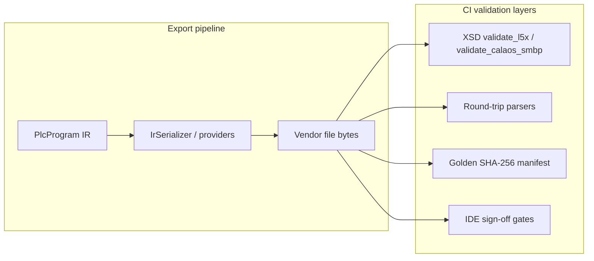

# Vendor Schema Maintenance

Operations guide for **export format validation** in PLCAutoPilot: what XSD artifacts exist today, how to update them when vendor tools change, and how to support **multiple IDE / firmware generations** in the field.

**Related:** [PHASE_5_IMPLEMENTATION.md](PHASE_5_IMPLEMENTATION.md) (P1 CI hardening), [RUNBOOK.md](../RUNBOOK.md) (verify commands), `automation/api/validation/`.

---

## 1. Did P1 ship full schemas for every provider?

**No.** P1 added rigorous XSD CI for **two** export paths only. Other vendors use different validation layers today.

| Provider | Export | P1 validation | Full vendor XSD? |
|----------|--------|---------------|------------------|
| **Rockwell** | `.L5X` | ✅ `l5x-v32.xsd` | **Yes** — community L5X XSD ([benmusson/l5x-schema](https://github.com/benmusson/l5x-schema), MIT). Matches `SoftwareRevision="32.00"` in our generator. |
| **Schneider** | Calaos `.smbp` | ✅ `calaos-case-2.0-subset.xsd` | **No** — PLCAutoPilot **subset** derived from `automation/samples/tankcontrol.smbp`. Official EcoStruxure `ProjectSchema.xsd` is proprietary and not redistributable. |
| **Siemens** | `.scl` (Tier-2) | Structural markers + parser round-trip | **No** — TIA Portal project XSD is proprietary; we ship source blocks only. |
| **Mitsubishi** | `.zip` (IL/ST/CSV) | ZIP member checks + parser | **No** — not XML; GX Works project format is binary. |
| **CODESYS / generic** | PLCopen `.xml` | Golden structure diff (`test_plcopen_golden.py`) | **Partial** — PLCopen TC6 0201 XSD exists publicly; not wired in P1. |

**What “full schema” means here**

- **Rockwell L5X:** XML instance validated against a complete L5X XSD for a given Logix Designer major version.
- **Schneider Calaos:** We validate **structure our IR pipeline emits**, not every element EcoStruxure might accept.
- **Tier-2 / PLCopen:** CI relies on **parser round-trip**, **golden hashes**, and **marker tests** until a suitable XSD is committed.

The canonical machine-readable registry is:

`automation/api/validation/schemas/manifest.json`

---

## 2. Architecture (how validation runs)



| Layer | When it runs | Catches |
|-------|----------------|---------|
| **IR `validate_program()`** | Every generate | Invalid logic graph before export |
| **XSD** | Rockwell + Schneider CI tests, IDE automated gates | Illegal XML shape vs committed XSD |
| **Round-trip parse** | `test_ir.py`, IDE gates | Tags/logic not readable back |
| **Golden export hash** | `test_golden_exports.py` | Unintended serializer drift |
| **Manual IDE import** | P0 lab (Windows) | Real Studio 5000 / EcoStruxure behavior |

---

## 3. File locations

| Path | Purpose |
|------|---------|
| `automation/api/validation/schemas/manifest.json` | Version registry (providers, files, ranges, notes) |
| `automation/api/validation/schemas/l5x-v*.xsd` | Rockwell L5X XSDs (one file per major version) |
| `automation/api/validation/schemas/calaos-case-2.0-subset.xsd` | Schneider subset XSD |
| `automation/api/validation/schema_registry.py` | Resolve which XSD applies to a given export |
| `automation/api/validation/xsd_validate.py` | `validate_l5x()`, `validate_calaos_smbp()` |
| `automation/api/tests/test_l5x_schema.py` | Rockwell XSD CI |
| `automation/api/tests/test_calaos_schema.py` | Schneider subset XSD CI |
| `automation/api/tests/test_schema_registry.py` | Manifest + version resolution |
| `automation/api/tests/fixtures/exports/manifest.json` | Golden export SHA-256 hashes |

---

## 4. Updating schemas when vendors change

### 4.1 Rockwell L5X (full XSD)

**When to update**

- You bump `SoftwareRevision` / `MajorRev` in `rockwell_generator.py` for new Studio 5000 defaults.
- A customer reports import failures on a specific Logix Designer version.
- You add support for a new controller family that requires a newer L5X schema.

**Steps**

1. **Identify target version**  
   Open a known-good `.L5X` from the target Studio 5000 build (or our export) and read:
   ```xml
   <RSLogix5000Content SoftwareRevision="32.00" ...>
   ```
   The **major** integer (`32`) selects `l5x-v32.xsd`.

2. **Obtain XSD**  
   Download the matching file from [benmusson/l5x-schema `schemas/`](https://github.com/benmusson/l5x-schema/tree/main/schemas) (MIT).  
   Save as:
   ```
   automation/api/validation/schemas/l5x-v{major}.xsd
   ```

3. **Register in manifest**  
   Edit `automation/api/validation/schemas/manifest.json`:
   - Add an entry under `providers.rockwell_l5x.versions[]` with `id`, `file`, `softwareRevisionRange`, `studio5000Hint`.
   - Set `defaultSchema` if the **CI default** export version changes.

4. **Align the generator** (if default changed)  
   Update `automation/plc_file_handler/generators/rockwell_generator.py`:
   - `SoftwareRevision`, `MajorRev` / `MinorRev` to match the field target.

5. **Run validation**
   ```bash
   cd automation
   uv run pytest api/tests/test_l5x_schema.py api/tests/test_schema_registry.py -v
   uv run pytest api/tests/test_golden_exports.py -v
   uv run pytest api/tests/test_ide_signoff.py -v
   ```

6. **Refresh golden hashes** (Rockwell rows will change)
   ```bash
   uv run python api/tests/update_golden_fixtures.py
   uv run pytest api/tests -q
   ```

7. **Refresh IDE sign-off bundle** (if Rockwell lab files changed)
   ```bash
   uv run python -m api.ide_signoff bundle
   ```

8. **Document** — add a row to §7 version history below and note the Studio 5000 version in RUNBOOK.

**Verify the right XSD is selected**

```python
from api.validation import detect_l5x_software_revision, resolve_l5x_schema_path
revision = detect_l5x_software_revision(l5x_bytes)
schema = resolve_l5x_schema_path(l5x_bytes).name
```

Or in tests: `validate_l5x(bytes, target_major=32)`.

---

### 4.2 Schneider Calaos (subset XSD)

**When to update**

- `schneider_calaos.py` or `tankcontrol.smbp` template changes structure (new required sections, `RungEntity` layout, etc.).
- EcoStruxure Machine Expert version changes `FileHeader@ProductVersion` semantics.

**Steps**

1. Export a **golden** `.smbp` from CI (`samples/tankcontrol.smbp` or `uv run python -m api.ide_signoff bundle`).
2. Diff XML structure against the previous template.
3. Edit `calaos-case-2.0-subset.xsd` — extend types/elements only where our pipeline emits them. Prefer `xs:any processContents="lax"` for deep ladder graphics to avoid brittle CI.
4. Update `manifest.json` → `schneider_calaos.versions` if you add a **new subset id** (e.g. `case-2.1-subset.xsd`) instead of mutating the existing file.
5. Run:
   ```bash
   uv run pytest api/tests/test_calaos_schema.py api/tests/test_schneider_calaos.py -v
   uv run python api/tests/update_golden_fixtures.py
   ```

**Do not** expect to drop in Schneider’s internal `ProjectSchema.xsd` — it is not in the repo and may not be licensed for CI redistribution.

---

### 4.3 Siemens / Mitsubishi / PLCopen (future XSD)

| Vendor | Recommended next step | Candidate artifact |
|--------|----------------------|-------------------|
| **PLCopen** | Add `plcopen-tc6-0201.xsd` + `validate_plcopen()` | [PLCopen TC6 0201](https://www.plcopen.org/) |
| **Siemens SCL** | Keep structural + TIA lab sign-off; optional Step 7 `.scl` grammar if published | No full project XSD in Tier-2 scope |
| **Mitsubishi** | ZIP manifest schema (custom) or GX import checklist | N/A for XML XSD |

Track these under `manifest.json` → `providers.*.notes` until implemented.

---

## 5. Supporting older hardware / older IDE versions (field)

Customers often run **older Studio 5000**, **older EcoStruxure Machine Expert**, or **older controller firmware** than CI defaults. Use a **side-by-side schema strategy** — never overwrite `l5x-v32.xsd` when adding `l5x-v28.xsd`.

### 5.1 Principles

1. **Commit multiple XSD files** — one per supported major L5X version (`l5x-v28.xsd`, `l5x-v32.xsd`, …).
2. **Register each** in `manifest.json` with `softwareRevisionRange` and `studio5000Hint`.
3. **Resolve at validate time** — `resolve_l5x_schema_path()` reads `SoftwareRevision` from the export XML.
4. **Generate for the customer’s target** — set generator attributes to the customer’s version so the file **declares** the revision their IDE expects.
5. **Validate against that revision’s XSD** — `validate_l5x(content, target_major=28)` or automatic resolution from content.

### 5.2 Rockwell example: Studio 5000 v28 site

| Step | Action |
|------|--------|
| 1 | Add `l5x-v28.xsd` from benmusson/l5x-schema |
| 2 | Register in `manifest.json` with range `28.00`–`28.99` |
| 3 | For that customer deployment, set in `rockwell_generator.py` (or future per-job metadata): `SoftwareRevision="28.00"`, `MajorRev="28"` |
| 4 | CI: add `test_l5x_schema.py` parametrized case or fixture export with v28 attributes |
| 5 | Manual: import lab `.L5X` in customer’s Studio 5000 v28 |

**Automatic resolution (already implemented)**

```python
# Uses SoftwareRevision major → l5x-v{major}.xsd, else defaultSchema
errors = validate_l5x(export_bytes)
```

**Explicit override (customer profile / support tooling)**

```python
errors = validate_l5x(export_bytes, target_major=28)
```

If `l5x-v28.xsd` is **not** in the repo, resolution **falls back** to `defaultSchema` (`l5x-v32.xsd`) — document this in support runbooks so engineers know to add the older XSD before promising v28 compliance.

### 5.3 Schneider example: older Machine Expert Basic

| Approach | Detail |
|----------|--------|
| **Same subset XSD** | If XML shape is unchanged, one subset file may cover 1.2–2.x; record `ProductVersion` in IDE sign-off manifest only. |
| **New subset file** | If an older EcoStruxure build rejects new elements, copy `calaos-case-2.0-subset.xsd` → `calaos-case-2.0-legacy-subset.xsd`, relax or remove new elements, register second version in manifest. |
| **Validation** | `validate_calaos_smbp()` uses `defaultSchema` today; extend `schema_registry.resolve_calaos_schema_path()` when multiple subsets exist (mirror L5X pattern). |

### 5.4 Customer deployment profile (recommended practice)

Maintain a **deployment profile** per customer or site (YAML/JSON in ops repo, not necessarily in product yet):

```yaml
customer: acme-line-3
targets:
  rockwell:
    studio5000Major: 28
    processor: "1769-L33ER"
    schemaFile: l5x-v28.xsd
  schneider:
    machineExpertVersion: "1.2.0.5"
    controller: "TM221CE24R"
    schemaFile: calaos-case-2.0-subset.xsd
validation:
  runIdeSignoffAnnually: true
  goldenExportSuite: full  # or pattern subset
```

**Pre-go-live checklist**

1. Profile documents target IDE + controller.
2. Committed XSD files exist for profile versions.
3. `uv run pytest api/tests/test_l5x_schema.py` passes for exports generated with profile attributes.
4. P0 manual IDE sign-off recorded in `api/tests/fixtures/ide_signoff/manifest.json` for that IDE version.
5. Golden hashes updated if generator output changed for that profile.

---

## 6. Ensuring the correct schema version (ongoing)

| Checkpoint | Command / artifact |
|------------|-------------------|
| **Registry complete** | `manifest.json` lists every committed `.xsd` |
| **CI default documented** | `ciDefault: true` on one version per provider |
| **Generator matches CI** | `rockwell_generator.py` `SoftwareRevision` == default L5X XSD major |
| **Automated tests** | `pytest api/tests/test_*_schema.py api/tests/test_schema_registry.py` |
| **Golden regression** | `pytest api/tests/test_golden_exports.py` |
| **IDE gates** | `uv run python -m api.ide_signoff run` |
| **Manual field gate** | P0 lab `ide_signoff record` with `ideVersion` |
| **Support diagnostic** | `validation_schema_used(bytes, vendor="rockwell")` → filename |

**When upgrading PLCAutoPilot in production**

1. Run full `uv run pytest api/tests -q` on the release tag.
2. Compare `manifest.json` and `fixtures/exports/manifest.json` release notes.
3. Re-run IDE import on **one file per provider** from `ide_signoff/exports/`.
4. If customer uses older Studio 5000, confirm their `l5x-v*.xsd` is still in `schemas/` before deploy.

---

## 7. Quick reference — update checklist

### Rockwell new major version

- [ ] Download `l5x-v{N}.xsd`
- [ ] Add to `automation/api/validation/schemas/`
- [ ] Update `manifest.json`
- [ ] Update generator `SoftwareRevision` / `MajorRev` if CI default moves
- [ ] `pytest api/tests/test_l5x_schema.py`
- [ ] `update_golden_fixtures.py` if hashes change
- [ ] `ide_signoff bundle` + manual lab if default changed

### Schneider template change

- [ ] Update `tankcontrol.smbp` / `schneider_calaos.py`
- [ ] Update subset XSD or add new subset file
- [ ] `pytest api/tests/test_calaos_schema.py`
- [ ] `update_golden_fixtures.py`

### Older customer (legacy IDE)

- [ ] Add older XSD file(s) — do not replace current default
- [ ] Register version range in `manifest.json`
- [ ] Generate exports with customer `SoftwareRevision` / product version
- [ ] Validate with `target_major` or auto-resolution
- [ ] Record manual IDE sign-off for that version

---

## 8. Version history

| Date | Change |
|------|--------|
| 2026-06-15 | P1: `l5x-v32.xsd`, `calaos-case-2.0-subset.xsd`, golden 4j exports |
| 2026-06-15 | Added `manifest.json`, `schema_registry.py`, this operations guide |

---

**Vendor Schema Maintenance | PLCAutoPilot**
